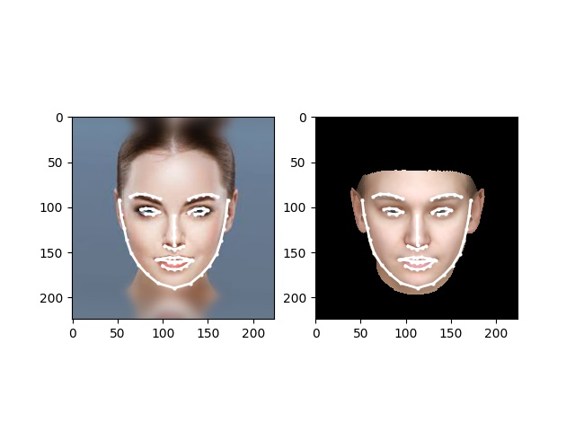
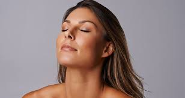
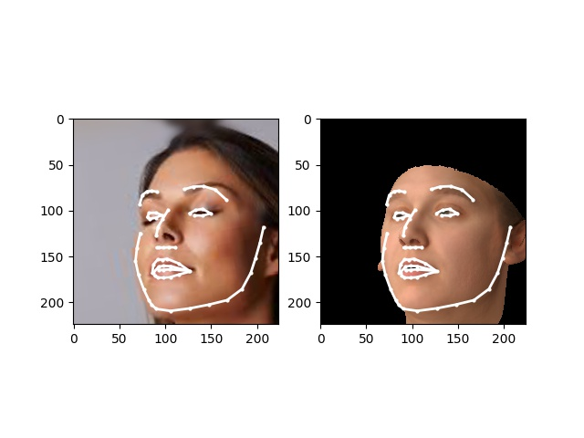
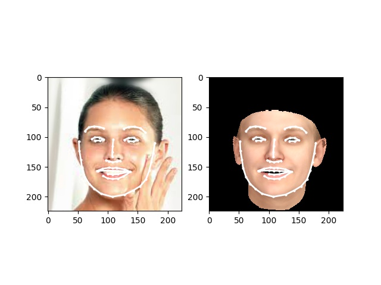
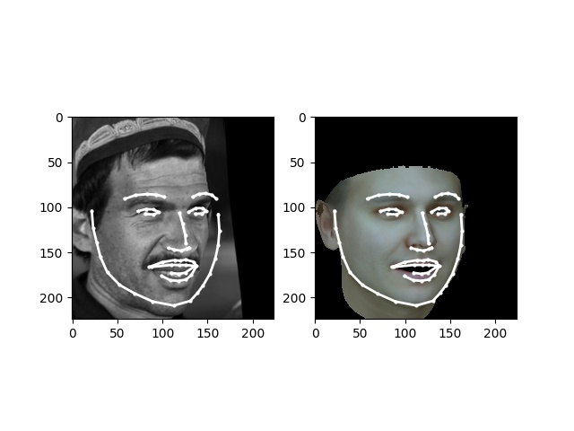
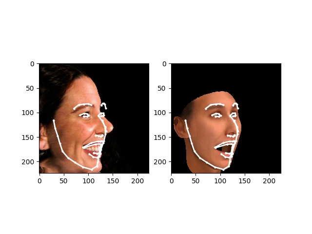
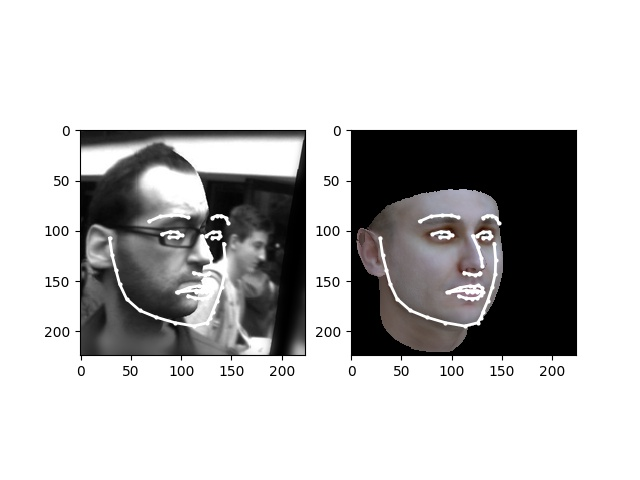

# Inverse Rendering 3DMM
This project uses CNN to do inverse rendering using 3DMM. In summary, it build 3DMM directly from a given image.

# Steps

1. detect face using dlib
2. extract landmark using dlib
3. crop the face region using detected landmark
    * we need this because we need to extract the face region as FFHQ as the model is trained on FFHQ dataset
4. using trained model to regress the 3DMM parameters

# Results

Images in `data/input` are found in google

input image 

rendered    

input image 

rendered    

input image 

rendered    

### Failed cases
image from 300W_LP

# Model

We use Resnet-17 in training. The input size is 224 x 224

# Training data

we use FFHQ dataset for training. Specifically, we first detect landmarks for images in FFHQ training. In training, the
loss function has two parts. First part is the landmark loss which aims to recover the shape and expression related 
parameters. The second part is the rendering loss which aims to recover the texture related parameters.

# How to run it

An example is provided in file [inverse_render_3dmm.py](./inverse_render_3dmm.py).

1. build the docker image
2. download data
    * BMF09
    * expression: [exp_80k.npz](https://drive.google.com/file/d/1lMLj_8_Z1gUcoURxs8hr1E7_HVBOSv8L/view?usp=sharing)
        * the expression is converted from https://github.com/Juyong/3DFace
    * parameter normalization: [stats_80k.npz](https://drive.google.com/file/d/1UCWdgYK5nWEONv2e7MSrxHiSLFg5-49d/view?usp=sharing)
    * trained model: [trained_model_20200725](https://drive.google.com/drive/folders/1_OXBJsU6G74Z_0Msd0t5rhaql4l6QSV3?usp=sharing) 
3. in [inverse_render_3dmm.py](./inverse_render_3dmm.py), set following parameters
    * n_tex_para: 40
    * n_shape_para: 100
    * param_mean_std_path: path to file `stats_80k.npz`
    * bfm_path: path to file `BFM.mat`
    * exp_path: path to file `exp_80k.npz`
    * pd_model_path: path to fold `trained_model_20200725`
    * image_size = 224
    * image_folder: input image folder
    * image_names: input image names
    * save_rendered_to: save rendered images and landmarks

# Issues

We trained the model on FFHQ dataset. For inference, we must crop the face exact the same way as FFHQ. Otherwise it 
does work well. To properly crop the face, landmark is needed. Thus, we use dlib to do face and landmark detection.
This step can fail. After the landmark is detected, we crop the face and rescale it to 224 x 224. Then we feed the
image to the trained model. 

As result, the performance highly depends on face and landmark detection. We notice that sometimes dlib will not
be able to detect face. Better face and landmark detector can be found here: https://github.com/1adrianb/face-alignment

One way to remove the landmark detector is to regenerate the training data from raw FFHQ dataset. Detect the face and crop 
the face region without using landmarks. Then retrain the model.

# License

NON-COMMERCIAL USE: The license granted is for internal, non-commercial research, evaluation or testing purposes only. Any use of the DATA/CODE or its contents to manufacture or sell products or technologies (or portions thereof) either directly or indirectly for any direct or indirect for-profit purposes is strictly prohibited.
NO WARRANTY: The data/code are provided "as is" and any express or implied warranties are disclaimed.
NO DISTRIBUTION: You are not allowed to sublicense or distribute the DATA/CODE in whole or in part to any third party.

BFM model: https://faces.dmi.unibas.ch/bfm/index.php?nav=1-2&id=downloads
FFHQ: https://github.com/NVlabs/ffhq-dataset